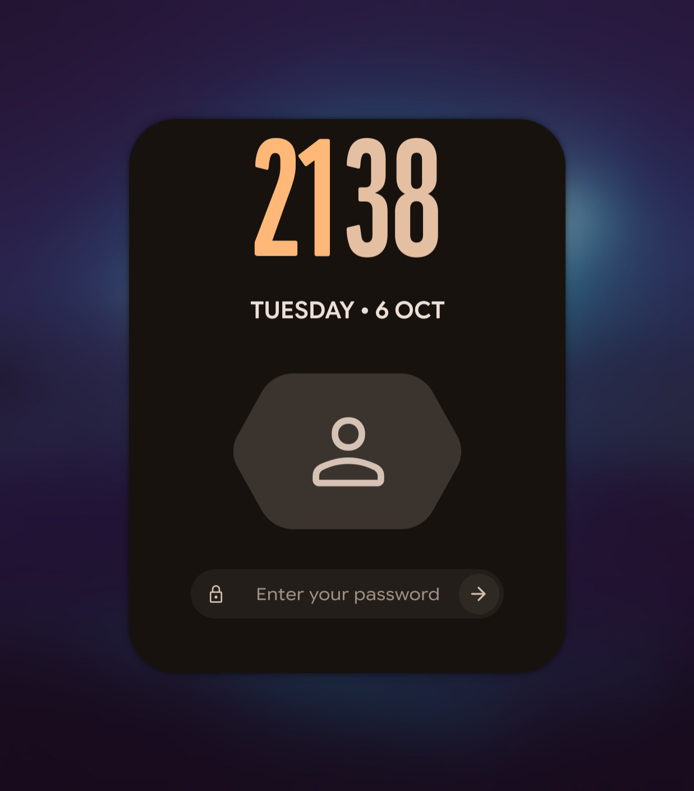

# caelestia-greeter

A [greetd](https://sr.ht/~kennylevinsen/greetd/) login screen that looks like the
[Caelestia](https://github.com/caelestia-dots/shell) lock screen: clock, date, avatar and
password field on your blurred wallpaper, in your current colour scheme.

<p align="center"></p>

It runs Quickshell inside a minimal Hyprland session. The greeter reuses Caelestia's own
lock-screen widgets from the installed `caelestia-shell` package, swapping PAM for greetd.

## Requirements

- Arch Linux with `caelestia-shell`, `quickshell` and Hyprland (Lua config, `start-hyprland`)
- `greetd` (installed by the installer)

## Install

```sh
sudo ./install.sh
systemctl --user enable --now caelestia-greeter-sync.path
systemctl --user start caelestia-greeter-sync.service
sudo systemctl disable sddm && sudo systemctl enable greetd   # or whatever DM you use
```

Reboot. Re-run `sudo ./install.sh` after a `caelestia-shell` update to pick up upstream changes.

### Going back

From a TTY (Ctrl+Alt+F2): `sudo systemctl disable greetd && sudo systemctl enable sddm`.

## How it works

| File | Purpose |
| --- | --- |
| `shell.qml`, `modules/greeter/` | Greeter UI. `GreetAuth.qml` mimics Caelestia's `Pam.qml` so the lock widgets work unchanged; without greetd it falls back to a PAM check so you can preview it. |
| `hyprland.lua`, `local.lua.example` | Minimal Hyprland config for the greeter session; machine settings come from `local.lua`. Exits the compositor when the greeter quits. |
| `sync.sh`, `systemd/` | User path unit that mirrors your scheme, wallpaper, Caelestia config and `~/.face` to `/var/lib/caelestia-greeter-sync`, which the greeter uses as `HOME`. |
| `greetd/config.toml` | greetd config. Gives Hyprland writable cache/state dirs, since the `greeter` user's home is `/`. |
| `install.sh` | Builds `/etc/caelestia-greeter` from the installed Caelestia shell plus this overlay; installs greetd config and PAM (with gnome-keyring unlock). |

## Configuration

Machine-specific settings go in `/etc/caelestia-greeter/local.lua` (see
[`local.lua.example`](local.lua.example)). The installer creates it on first install with
your username, and keeps it on reinstall. To keep it in your checkout instead, put a
`local.lua` next to `install.sh` (it is git-ignored) and the installer will use that.

- Monitors: copy the `hl.monitor` blocks from your Hyprland config.
- `CAELESTIA_GREETER_USER`: user preselected until someone has logged in (after that, the last user is remembered).
- `CAELESTIA_GREETER_MONITOR`: monitor that shows the login card (others show the wallpaper).
  Falls back to the first screen if it isn't connected.
- `CAELESTIA_GREETER_SESSION`: session command (default `start-hyprland`).
- `CAELESTIA_GREETER_AVATAR_SHAPE`: avatar shape, a [Material shape](https://m3.material.io/styles/shape/overview) name such as `Cookie9Sided` (default) or `Square`. Give several, comma separated, to pick one at random on each start.

Keyboard layout and other Hyprland options are in `hyprland.lua`.

## Users

All accounts with a UID of 1000 or more and a real login shell are listed. With more than
one, switch with ←/→, the arrows, or by clicking the avatar. The last user to log in is
preselected (stored in `/var/cache/caelestia-greeter/last-user`).

Avatars come from `/var/lib/AccountsService/icons/<user>` (what GNOME/KDE settings write),
falling back to the synced `~/.face` for the user running the theme sync. Everyone sees that
user's colours and wallpaper on the login screen.

## Preview without logging out

```sh
CAELESTIA_GREETER_HOME=/var/lib/caelestia-greeter-sync CAELESTIA_GREETER_CACHE=/tmp/cg-cache \
    start-hyprland -- --config /etc/caelestia-greeter/hyprland.lua
```

Opens the installed greeter in a nested Hyprland window. Without greetd the password is
checked against your own account and the session launch is only logged. Set
`CAELESTIA_GREETER_PASSWD` to a fake passwd file to preview the user switcher.

## Limitations

- No session picker.
- One theme for the login screen (from the user running the sync).
- No "switch user" while logged in: greetd runs one session at a time.
- No fingerprint / face unlock.

## Credits

All of the visual design and the lock-screen widgets come from
[caelestia-dots/shell](https://github.com/caelestia-dots/shell). This project only adapts
them for greetd. Built on [Quickshell](https://quickshell.org) and [greetd](https://sr.ht/~kennylevinsen/greetd/).

## License

GPL-3.0, as it is derived from Caelestia's shell.
